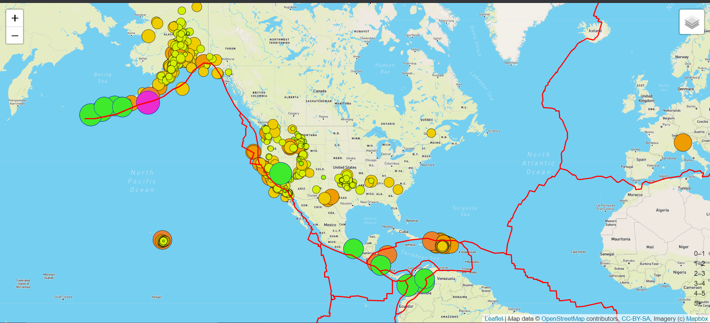
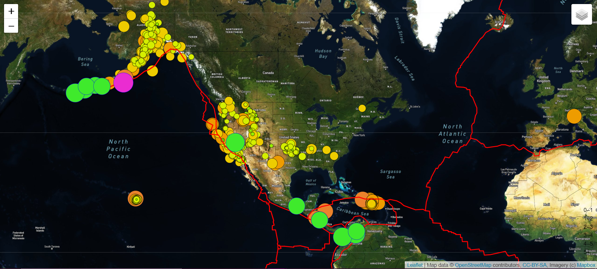
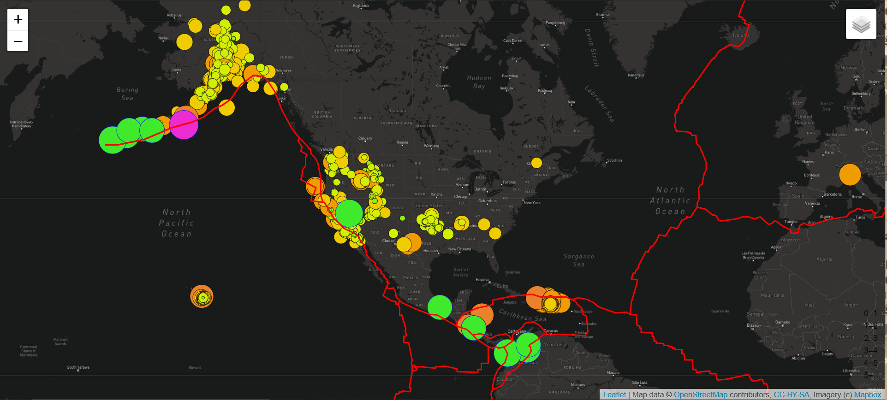

# Mapping_Earthquake
# Overview: 
Creating an earthquake map that has three different type of map layouts.  These three different types of maps are a street view, satellite view, and a dark view.  We are also creating overlays to the map that show the earthquakes, tectonic plates, and major earthquakes. 

1) Street View 

2) Satellite View 

3) Dark View 

# Results: 
We can see that where the tectonic plates lay have a relation to the amount of earthquakes occur in that area. 

# Summary: 
The website is well organized and clearly labeled with the ability to change the view as needed. 

